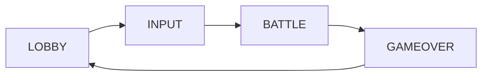

# KanaClash マルチプレイヤー実装完了

## 🎉 実装サマリー

### 新規作成ファイル
| ファイル | 説明 |
|----------|------|
| `src/lib/supabase.ts` | Supabaseクライアント初期化 + 型定義 |
| `src/hooks/useRoom.ts` | ルーム管理フック（作成/参加/購読） |
| `src/components/LobbyScreen.tsx` | ルーム作成・参加・待機画面 |
| `.env.example` | 環境変数サンプル |

### 変更ファイル
| ファイル | 変更内容 |
|----------|----------|
| `src/store/gameStore.ts` | マルチプレイヤー対応（Supabase同期） |
| `src/components/InputScreen.tsx` | 各自入力に変更 |
| `src/components/BattleScreen.tsx` | ターン制御 + リアルタイム同期 |
| `src/components/GameOverScreen.tsx` | 勝敗表示更新 |
| `src/App.tsx` | LOBBYフェーズ追加 |

### 削除ファイル
| ファイル | 理由 |
|----------|------|
| `src/components/SetupScreen.tsx` | LobbyScreenに統合 |

---

## 🎮 ゲームフロー



1. **LOBBY**: ルーム作成 or URL/ルームIDで参加
2. **INPUT**: 各自が自分のスマホで単語を入力（他プレイヤーには見えない）
3. **BATTLE**: 順番に五十音を選んで攻撃（自分のターンのみ操作可能）
4. **GAMEOVER**: 全員に単語公開、ホストが再スタート可能

---

## ✅ テスト手順

### ローカルテスト（環境変数必須）
1. `.env.local` を作成:
```
VITE_SUPABASE_URL=your-project-url
VITE_SUPABASE_ANON_KEY=sb_publishable_xxxxx
```

2. 開発サーバー起動:
```bash
npm run dev
```

3. 2つのブラウザ（またはシークレットモード）でアクセス

### 本番テスト
- Vercelで自動デプロイ済み
- https://kanaclash.vercel.app （または割り当てられたURL）にアクセス
